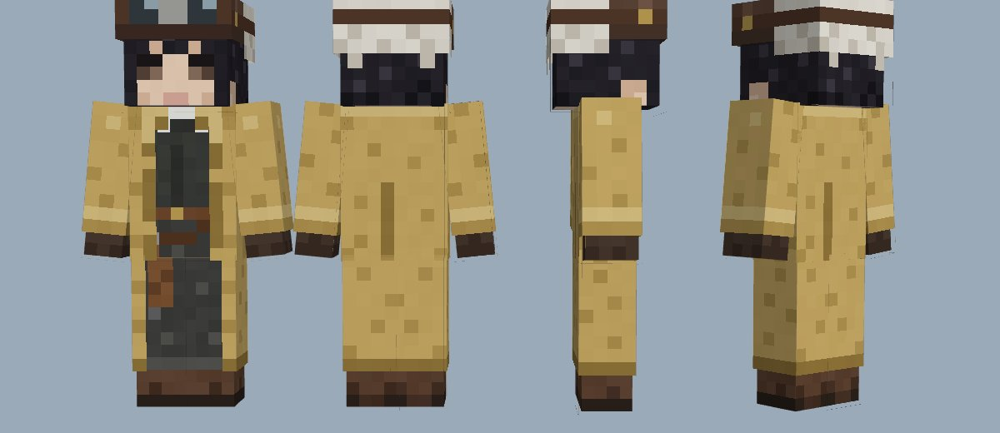
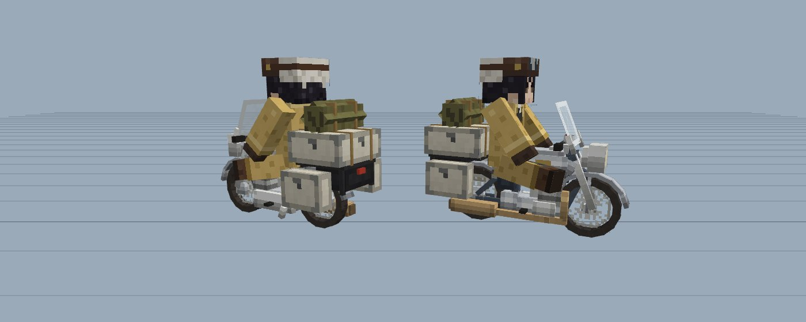
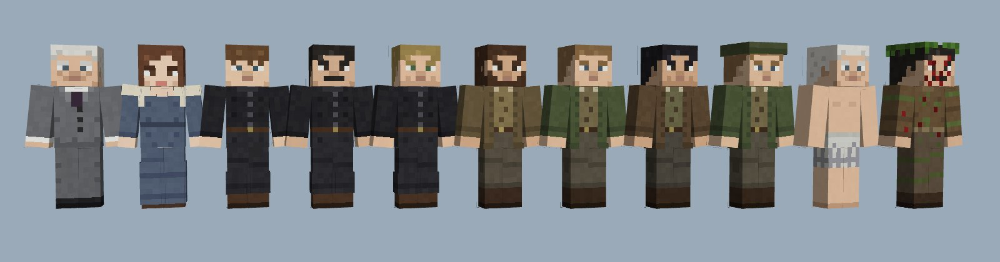
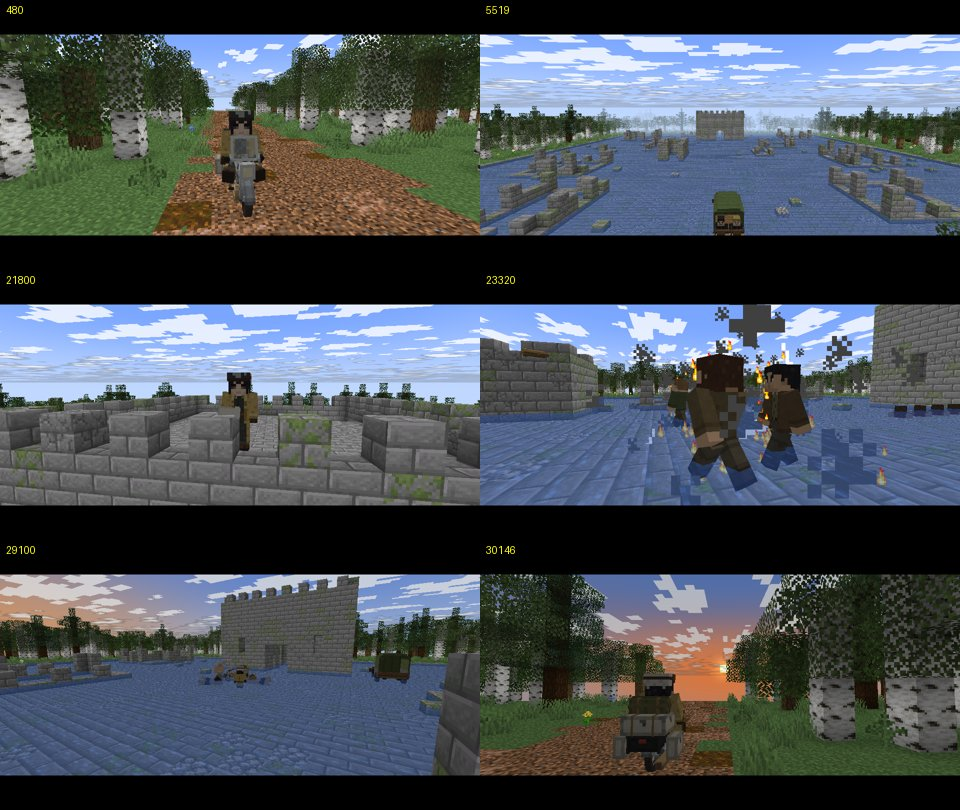

# 奇诺之旅 · 第七话「战斗者的故事 —Reasonable—」Minecraft 版

用 Minecraft（Java 版）拍摄的《奇诺之旅》第七话同人电影。仓库里有：

- **资源包**：由立绘转换的奇诺皮肤、按插画重建的艾鲁梅斯（摩托车）3D 模型、其余 20 个角色皮肤、卡车、大炮、「长笛」「卡农」等道具模型，以及电影遮罩（宽银幕黑边、狙击镜、望远镜）。
- **数据包**：一条命令搭好全部场景（春天的森林道路、被水淹没的碉堡遗迹、旅馆房间），再用一条命令在游戏里自动放映整部电影（约 25 分 35 秒，19 场，206 个镜头，375 句中文字幕）。
- **生成工具**：皮肤、模型、场景、剧本全部由 `tools/` 里的 Python 代码生成；同一份剧本还能用网页渲染器输出预览视频。

| 奇诺皮肤（纤细手臂，64×64） | 艾鲁梅斯 + 奇诺 |
| --- | --- |
|  |  |




## 在游戏里放映

**需要 Minecraft Java 版 1.21.9 或更新版本**（演员使用 1.21.9 新增的「人体模型」Mannequin 实体，并用资源包里的贴图作为皮肤，不需要上传到正版账号）。

1. 新建世界：游戏模式随意，世界类型选 **超平坦**，预设选 **虚空（The Void）**，并**允许作弊**。
2. 把 `dist/奇诺之旅_资源包.zip` 放进 `.minecraft/resourcepacks` 并启用。
3. 把 `dist/奇诺之旅_数据包.zip` 放进存档的 `datapacks` 文件夹（或在创建世界时的「数据包」界面拖入）。
4. 进入世界后运行：

   ```
   /function kino:setup     搭建全部场景（约 1 分钟，期间请留在世界里）
   /function kino:play      从头开始放映
   /function kino:scenes    列出 19 场，点击即可从该场开始
   /function kino:stop      停止放映
   /function kino:cleanup   清除所有演员与道具
   ```

放映时的建议设置：视野 FOV 70、渲染距离 ≥ 12 区块、界面尺寸「自动」。**不要按 F1**——字幕（动作栏）和宽银幕黑边属于界面层。录制可以用 OBS，或用 Replay Mod 离线渲染成高画质视频。

### 单独使用皮肤和模型

- 皮肤文件在 `resourcepack/assets/kino/textures/entity/skins/`，奇诺是 `kino.png`（**纤细/Alex 手臂**）。也可以直接上传到 minecraft.net 作为自己的皮肤。
- 生成一个人体模型并穿上奇诺皮肤：
  `/summon mannequin ~ ~ ~ {profile:{texture:"kino:entity/skins/kino",model:"slim"}}`
- 拿到艾鲁梅斯：`/give @s stick[item_model="kino:hermes"]`；放一辆在地上：
  `/summon item_display ~ ~0.63 ~ {item:{id:"stick",count:1,components:{"minecraft:item_model":"kino:hermes"}},transformation:{left_rotation:[0f,0f,0f,1f],right_rotation:[0f,0f,0f,1f],translation:[0f,-0.13f,0f],scale:[1f,1f,1f]}}`
  （车头朝向实体的朝向；让人体模型 `ride` 上去就是骑乘姿势，坐在座垫上。）
- 其它模型：`truck`（请用 `scale:[2f,2f,2f]`、`translation:[0f,1f,0f]`）、`cannon`、`cannon_barrel`、`baby`、`flute` / `flute_carry`（奇诺的「长笛」）、`canon`（「卡农」左轮）、`rifle`、`srifle`、`grenade`、`radio`、`mug`、`wine`、`bottle`、`knife`、`axe`、`binoculars`、`board`。

## 这部电影是怎么在游戏里「拍」出来的

| 需求 | 做法 |
| --- | --- |
| 演员 | `minecraft:mannequin`，`profile` 里用 `texture`/`model` 指向资源包皮肤；`NoGravity` + 每刻 `tp` 移动（客户端会自动播放走路动画） |
| 端枪瞄准 | 手持**已装填的弩**，但用 `item_model` 换成枪的模型 → 双手举枪姿势；平时拿的是 `stick[item_model=…_carry]` |
| 骑车 / 坐下 | 演员 `ride` 一个 `item_display`（艾鲁梅斯本身，或看不见的座位实体） |
| 倒地 | `pose:"swimming"`（趴下）/ `"sleeping"`（仰躺） |
| 摄影机 | 玩家旁观模式 `spectate` 一个带 `teleport_duration` 的 `item_display`，镜头运动平滑；切镜头前把插值临时设为 0 |
| 宽银幕、瞄准镜、望远镜、黑场 | 给玩家头上戴一个带 `equippable.camera_overlay` 的物品（和南瓜头遮罩同一机制） |
| 字幕 / 片名 | `title … actionbar`（每 1.5 秒刷新）/ `title … title` |
| 时间线 | 每一刻一个函数 `kino:film/t/<刻>`，由宏 `$function kino:film/t/$(f)` 调用；`kino:scene/<n>` 会重建该场开始时的完整状态 |
| 场景 | 贪心合并的 `fill`（每条 ≤ 32768 方块）+ 树木结构模板（`place template`）+ `fillbiome` 白桦森林配色 |
| 爆炸、火焰、血迹、水花 | 原版粒子与音效（燃烧用每刻粒子，因为站在水里的实体会立刻熄火） |

## 重新生成

```bash
pip install pillow numpy scipy
python3 tools/build.py              # 皮肤、模型、遮罩、数据包 → dist/*.zip

# 预览视频（需要 Node 与 Playwright/Chromium；原版方块贴图会通过 npm 的 minecraft-assets 包下载，不收录在本仓库）
cd web && npm install && cd ..
python3 tools/build.py --preview    # 另外生成 build/preview/（世界网格数据、剧本 JSON）
python3 tools/audio.py              # 合成音效与配乐
python3 -m http.server 8765 &       # 渲染器通过本地服务器读取文件
python3 tools/render.py 3 1280 720 20   # → build/奇诺之旅_第七话_Minecraft.mp4
```

目录：

```
tools/skins.py        22 个角色皮肤（像素画以字符画写成）
tools/models.py       物品模型（艾鲁梅斯、卡车、大炮…）与自动打包的贴图
tools/world.py        场景方块数据（森林道路、侧路、水之遗迹、碉堡、旅馆）
tools/script.py       剧本：演员走位、镜头、台词、特效（整部电影就在这里）
tools/film.py         剧本 DSL 与逐刻采样
tools/compile_mc.py   剧本 → 数据包
web/                  three.js 渲染器（预览视频与网页播放器共用）
resourcepack/         生成好的资源包
dist/                 可直接使用的资源包 / 数据包压缩包
```

## 改编说明与已知限制

- 剧情按原文顺序改编：森林里的相遇、旅馆的委托（倒叙）、狙击、障碍物与侧路、水之遗迹、真正的山贼尸体、医生的坦白、投降者、抛尸与交涉、大炮、狙击兵的结局、干杯，以及黄昏与尾声的旁白。部分叙述性文字改成字幕旁白，少量对话为衔接而精简。血腥描写以粒子与镜头回避处理。
- Minecraft 的演员无法做挥手、踢腿、拥抱等动作，这些动作用剪辑、音效和道具（例如被踢飞的左轮）来表达。
- **本项目在无法运行 Minecraft 的环境中制作**：命令语法按 1.21.9–1.21.11 的规范编写，并用网页渲染器按相同时间线验证了镜头与走位，但数据包本身**尚未在游戏客户端里实测**。若某些版本的细节不同（例如人体模型的 `profile` 字段、游戏规则改名），请告诉我具体报错，我会修正。游戏规则写在单独的函数里，某个版本不认识也不会影响其余内容。
- 预览视频中的方块/粒子贴图来自 Minecraft 原版（© Mojang），仅在本地渲染时下载使用。

原作：时雨泽惠一《奇诺之旅》（插画：黑星红白）。本作为粉丝向非商业改编；角色皮肤与模型为本项目原创绘制。
